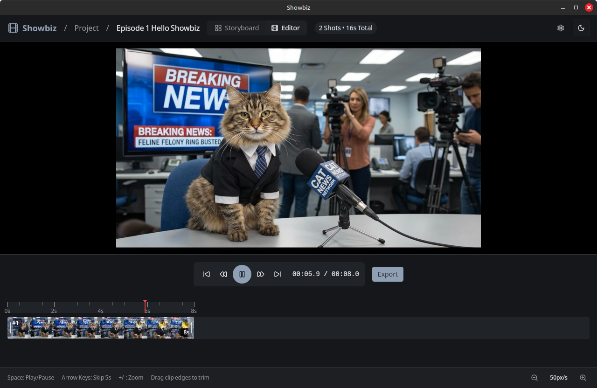

<p align="center">
  <h1 align="center">Showbiz</h1>
  <p align="center">
    AI-powered video storyboard desktop app.<br/>
    Generate images, turn them into videos, trim and arrange on a timeline, and export a final movie.
  </p>
  <p align="center">
    <a href="https://github.com/alexanderwanyoike/showbiz/actions/workflows/ci.yml"></a>
    <a href="https://github.com/alexanderwanyoike/showbiz/releases"></a>
    <a href="LICENSE"></a>
  </p>
</p>

<p align="center">
  
</p>

## Download

Grab the latest release for your platform from [**Releases**](https://github.com/alexanderwanyoike/showbiz/releases):

| Platform | Formats |
|----------|---------|
| Linux | `.deb`, `.rpm`, `.AppImage` |
| macOS | `.dmg` |
| Windows | `.exe` (installer), `.msi` |

You'll also need [**mpv**](https://mpv.io/) installed for video playback (see [Prerequisites](#prerequisites)).

## Features

- **Project organization** — create projects, each containing multiple storyboards
- **Shot-based workflow** — add shots to a storyboard, each with its own image and video prompt
- **Image generation** — generate images with Nano Banana or Nano Banana Pro, or upload your own
- **Image editing** — edit generated images with inpainting and prompt-based edits
- **Image version tree** — every generation/edit creates a version; switch between versions non-destructively
- **Video generation** — generate videos from images using Veo 3 or Veo 3 Fast with synchronized audio
- **Video version tree** — regenerate videos and keep all versions; switch freely
- **Timeline editor** — arrange shots, trim clips, preview playback
- **Video export** — assemble all shots into a single video via FFmpeg.wasm
- **Embedded video playback** — mpv player embedded directly into the app window
- **Dark/light theme** — system-aware with manual toggle
- **Config-driven models** — add new models by dropping a JSON file, no code changes needed

## Supported Models

### Image Generation

| Model | Provider | Editing |
|-------|----------|---------|
| Nano Banana | Google (Gemini 2.5 Flash) | Yes |
| Nano Banana Pro | Google (Gemini 3 Pro) | Yes |

### Video Generation

| Model | Provider | Duration | Audio |
|-------|----------|----------|-------|
| Veo 3 | Google | 8s | Yes |
| Veo 3 Fast | Google | 8s | Yes |

All models support both text-to-video and image-to-video generation.

## API Keys

You need at least one API key to generate content. Configure them in **Settings** within the app, or set environment variables:

| Key | Environment Variable | Models |
|-----|---------------------|--------|
| **Gemini** | `GEMINI_API_KEY` | Nano Banana, Nano Banana Pro, Veo 3, Veo 3 Fast |

Keys are stored in the local SQLite database and never leave your machine except to authenticate API calls.

## Tech Stack

| Layer | Technology |
|-------|-----------|
| Desktop framework | [Tauri v2](https://v2.tauri.app/) |
| Frontend | React 19, Vite, React Router v7 |
| Styling | Tailwind CSS v4, shadcn/ui, Radix |
| Backend | Rust — SQLite (rusqlite), file I/O, mpv IPC |
| Video playback | mpv via native window embedding |
| Video assembly | FFmpeg.wasm (in-browser) |
| Testing | Vitest (frontend), built-in (Rust) |

## Architecture

Hybrid Tauri v2 app — Rust backend owns persistent state (SQLite, file system, mpv process), TypeScript frontend owns the UI and calls external model APIs directly. Models are config-driven: add a JSON file to `src/lib/models/providers/` and it's auto-discovered at build time with zero code changes.

See [**docs/architecture.md**](docs/architecture.md) for full documentation including system diagrams, generation flow, model registry internals, version trees, and database schema.

## Prerequisites

### Required

- [Node.js](https://nodejs.org/) (v20+)
- [Yarn](https://yarnpkg.com/) (`npm install -g yarn`)
- [Rust](https://rustup.rs/) (stable)
- [mpv](https://mpv.io/) — required for video playback

### Platform-Specific Dependencies

**Linux (Debian/Ubuntu):**
```bash
sudo apt install libwebkit2gtk-4.1-dev libgtk-3-dev libayatana-appindicator3-dev \
  librsvg2-dev libx11-dev patchelf mpv
```

**Linux (Fedora):**
```bash
sudo dnf install webkit2gtk4.1-devel gtk3-devel libappindicator-gtk3-devel \
  librsvg2-devel mpv
```

**macOS:**
```bash
xcode-select --install
brew install mpv
```

**Windows:**
```powershell
scoop install mpv    # or: winget install mpv
```

## Development

```bash
yarn install
yarn dev              # Launch Tauri dev mode (frontend + Rust backend)
```

Other commands:
```bash
yarn build            # Production build
yarn dev:frontend     # Frontend-only dev server
yarn build:frontend   # Frontend-only build
yarn test             # Run tests
yarn test:watch       # Run tests in watch mode
```

## Platform Notes

- **Wayland** — the app runs under XWayland (`GDK_BACKEND=x11`) because mpv embedding requires X11 window handles.
- **mpv path override** — set `SHOWBIZ_MPV_PATH=/path/to/mpv` to use a custom binary.
- **Data directory** — media and database are stored in your system's app data directory (`~/.local/share/com.showbiz.app/` on Linux).

## Contributing

1. Fork the repository
2. Create a feature branch off `dev`
3. Open a PR targeting `dev`

See the [PR template](.github/pull_request_template.md) and [issue templates](.github/ISSUE_TEMPLATE/) for guidance.

## License

[MIT](LICENSE)
