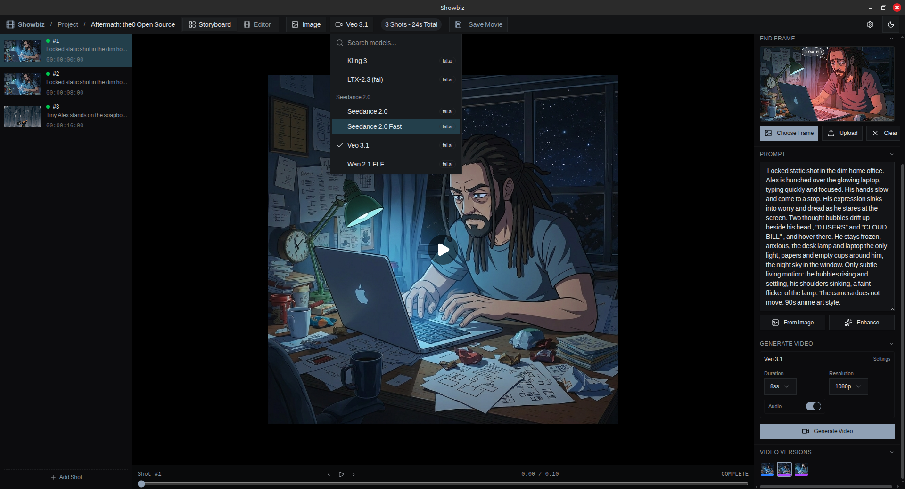
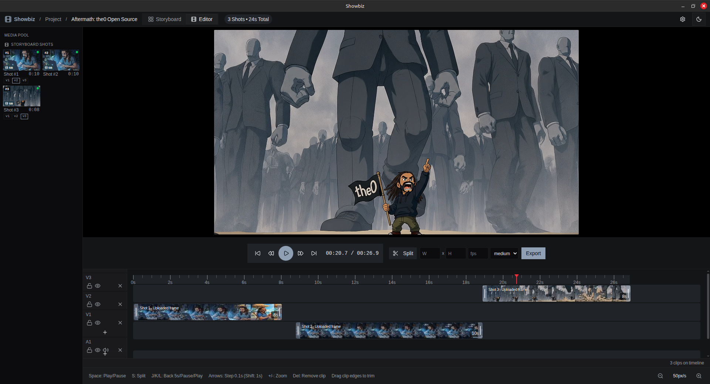

<p align="center">
  <h1 align="center">Showbiz</h1>
  <p align="center">
    AI-powered video storyboard desktop app.<br/>
    Generate images, turn them into videos, trim and arrange on a timeline, and export a final movie.
  </p>
  <p align="center">
    <a href="https://github.com/alexanderwanyoike/showbiz/actions/workflows/ci.yml"></a>
    <a href="https://github.com/alexanderwanyoike/showbiz/releases"></a>
    <a href="LICENSE"></a>
  </p>
</p>

<p align="center">
  
  <br/>
  <em>Storyboard mode — build each shot from a start/end frame and a prompt, pick a model, generate</em>
</p>

<p align="center">
  
  <br/>
  <em>Editor mode — arrange, trim and split shots on a multi-track timeline, then export with native ffmpeg</em>
</p>

## Download

Grab the latest release for your platform from [**Releases**](https://github.com/alexanderwanyoike/showbiz/releases):

| Platform | Formats |
|----------|---------|
| Linux | `.AppImage`, `.deb` |
| macOS | `.dmg` |
| Windows | `.exe` (installer) |

## Features

- **Project organization** — create projects, each containing multiple storyboards
- **Project bible** — reusable characters, locations, props and styles; compose consistent scene frames from them
- **Shot-based workflow** — each shot has a start frame, an optional end frame, and a prompt; the video model animates between the frames
- **Image generation & editing** — Nano Banana family, GPT Image 2, Flux; inpainting and prompt-based edits
- **Image & video version trees** — every generation/edit creates a version; switch non-destructively
- **Video generation** — Veo 3.1, Seedance 2, Kling 3, LTX-2.3, Wan 2.1 with start/end-frame support where the model has it
- **Timeline editor** — multi-track arrange, trim, split, preview playback
- **Video export** — native ffmpeg assembles the final movie with progress reporting
- **Dark/light theme** — system-aware with manual toggle
- **Config-driven models** — add new models by dropping a JSON file, no code changes needed

## Supported Models

### Image Generation

| Model | Provider |
|-------|----------|
| Nano Banana / Nano Banana 2 / 2 Lite / Pro | Google (Gemini) |
| GPT Image 2 | OpenAI (via fal.ai) |
| Flux Dev / Flux Kontext | Black Forest Labs (via fal.ai) |

### Video Generation

| Model | Provider | End frames |
|-------|----------|------------|
| Veo 3.1 | Google (via fal.ai) | Optional |
| Seedance 2.0 / 2.0 Fast | ByteDance (via fal.ai) | Optional |
| Kling 3 | Kuaishou (via fal.ai) | No |
| LTX-2.3 | Lightricks (via fal.ai) | No |
| Wan 2.1 FLF | Alibaba (via fal.ai) | Required |

## API Keys

You need at least one API key to generate content. Configure them in **Settings** within the app:

| Key | Models |
|-----|--------|
| **Gemini** | Nano Banana family |
| **fal.ai** | GPT Image 2, Flux, Veo 3.1, Seedance, Kling, LTX, Wan |

Keys are stored in the local SQLite database and never leave your machine except to authenticate API calls.

## Tech Stack

| Layer | Technology |
|-------|-----------|
| Desktop framework | [Electron](https://www.electronjs.org/) |
| Frontend | React 19, Vite, React Router v7 |
| Styling | Tailwind CSS v4, shadcn/ui, Radix |
| Backend | Electron main process — SQLite (`node:sqlite`), file I/O |
| Video playback | HTML5 `<video>` (Chromium) |
| Video export | Native ffmpeg (`ffmpeg-static`) |
| Testing | Vitest |

## Architecture

Electron app — the main process owns persistent state (SQLite, file system, ffmpeg export), the renderer owns the UI and calls external model APIs directly. Models are config-driven: add a JSON file to `src/lib/models/providers/` and it's auto-discovered at build time with zero code changes.

See [**docs/architecture.md**](docs/architecture.md) for full documentation including system diagrams, generation flow, model registry internals, version trees, and database schema.

## Prerequisites

- [Node.js](https://nodejs.org/) (v22+)
- [Yarn](https://yarnpkg.com/) (`npm install -g yarn`)

## Development

```bash
yarn install
yarn dev              # Launch Electron dev mode (Vite + Electron shell)
```

Other commands:
```bash
yarn build            # Production Electron build (installers in dist-package/)
yarn dev:frontend     # Frontend-only dev server
yarn build:frontend   # Frontend-only build
yarn test             # Run tests
yarn test:watch       # Run tests in watch mode
```

## Platform Notes

- **Data directory** — media and database are stored in your system's app data directory (`~/.local/share/com.showbiz.app/` on Linux).
- **macOS** — unsigned builds need `xattr -cr /Applications/Showbiz.app` after install to clear Gatekeeper's "damaged" error.

## Contributing

1. Fork the repository
2. Create a feature branch off `dev`
3. Open a PR targeting `dev`

See the [PR template](.github/pull_request_template.md) and [issue templates](.github/ISSUE_TEMPLATE/) for guidance.

## License

[MIT](LICENSE)
