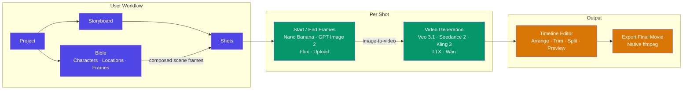
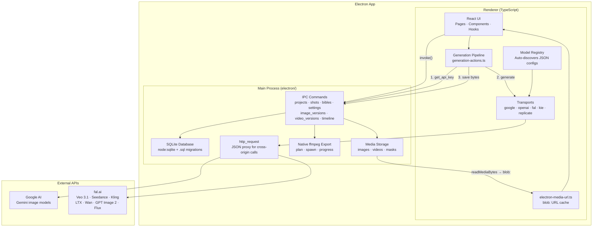
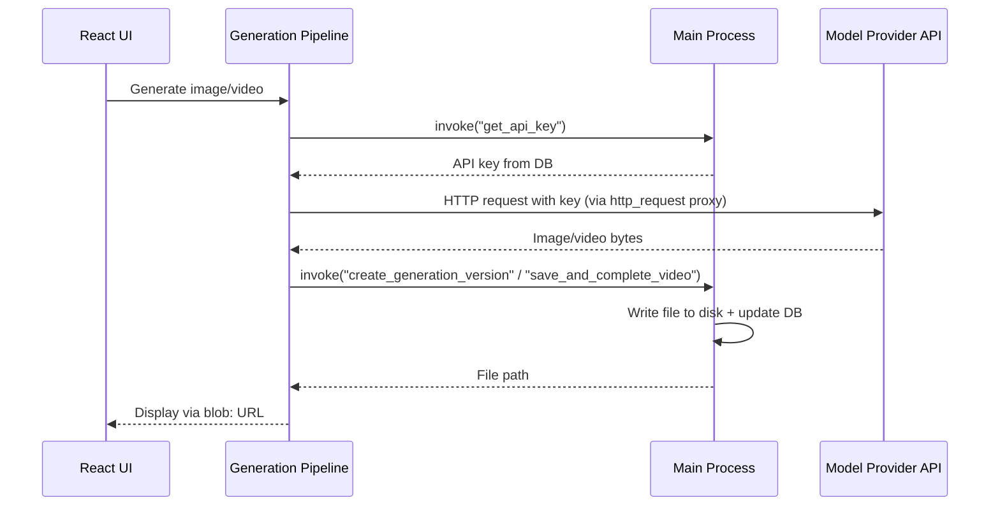
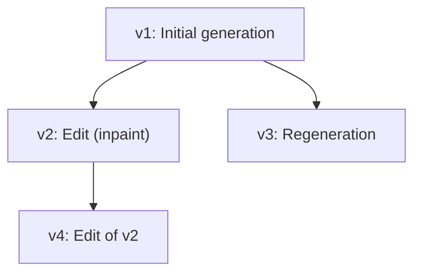

# Architecture

Showbiz is an [Electron](https://www.electronjs.org/) desktop app. The main process owns all persistent state — database, file system, and video export. The TypeScript renderer owns the UI and makes API calls to external model providers. They communicate over a small IPC bridge (`window.showbiz`).

## High-Level Overview

## System Architecture

### Why the split?

API calls live in the renderer because:
- Model providers have complex, varied APIs (queueing, polling) that are easiest to iterate on in the frontend
- The frontend already has the generation UI state and can show real-time progress
- API keys are fetched from the main process on demand and discarded after use

Persistence lives in the main process because:
- `node:sqlite` gives synchronous, dependency-free SQLite
- File I/O stays out of the sandboxed renderer
- ffmpeg is a native child process

Cross-origin API calls go through the main-process `http_request` command (the renderer's fetch is CORS-bound). It sends a single JSON string body, so providers must expose JSON endpoints (not multipart).

## Media Serving

Media files are served **blob-over-IPC**: the renderer asks the preload bridge for a file's bytes (`readMediaBytes`), wraps them in a `Blob`, and caches the resulting `blob:` URL per absolute path (`src/lib/electron-media-url.ts`). Saves that overwrite a file in place invalidate the cached URL.

A custom streamed protocol is deliberately avoided: Electron's `protocol.handle` mishandles Chromium's abort-and-resume media fetch pattern.

## Generation Flow

fal.ai models submit to a queue and poll for the result. Polling survives transient failures (network errors, 5xx, 429) for up to 5 consecutive attempts; the error message always names the fal request id so a completed job can be recovered from `https://queue.fal.run/{endpoint}/requests/{id}`.

## Config-Driven Model System

Each model is a JSON config file in `src/lib/models/providers/`. At build time, Vite's `import.meta.glob` auto-discovers all configs. The registry validates them against a schema and wires each one to the appropriate transport. Adding a model that uses an existing API provider requires zero TypeScript — just a JSON file.

Video configs can declare per-mode inputs: `inputs.endImage: "required"` makes validation reject start-only shots pre-submit (Wan FLF), and an `endFrameEndpoint` block routes start-only vs start+end requests to different provider endpoints with their own parameter names (Veo 3.1).

### Transports

Transports handle the API specifics for each provider. Most models reuse an existing transport — you only need a new one when integrating a completely new API.

| Transport | API | Example models |
|-----------|-----|----------------|
| `google-image` | Gemini `generateContent` | Nano Banana |
| `google-interactions-image` | Gemini Interactions API | Nano Banana 2 / Pro |
| `openai-image` | OpenAI Responses API | GPT Image 2 (direct) |
| `fal-image` | fal.ai queue | GPT Image 2, Flux |
| `fal-video` | fal.ai queue | Veo 3.1, Seedance 2, Kling 3, LTX-2.3, Wan |
| `kie-*`, `replicate-*` | kie.ai, Replicate | disabled alternates |

### Adding a New Model

1. Create a JSON config in `src/lib/models/providers/video/` or `image/`
2. Set the `transport`, `apiKeyProvider`, model IDs, capabilities, and defaults
3. Run `yarn test` — schema validation catches mistakes automatically

To add a completely new API provider, implement a transport in `src/lib/models/transports/`.

## Version Trees

Both images and videos use a version tree system. Every generation or edit creates a new version linked to its parent. Users can switch between versions non-destructively at any time.

Image versions and video versions are tracked independently per shot, stored in the `image_versions` and `video_versions` tables with self-referential `parent_version_id` foreign keys. Timeline clips may pin a specific video version; unpinned clips follow the shot's current version.

## Video Export

Export runs native ffmpeg in the main process (`electron/export.ts`):

1. The renderer sends clip identity + trim + position (its clip URLs are `blob:`, useless for ffmpeg)
2. The main process resolves each clip's source file from the DB
3. `buildExportPlan` orders clips by timeline position and inserts black+silence segments for gaps
4. Trims map to `-ss`/`-to` input options (`-to` is absolute from file start)
5. Output settings (resolution, fps) default to probing the first clip; `-progress pipe:1` streams progress back over IPC

The storyboard-mode "assemble movie" flow reuses the same exporter, laying every completed shot end to end with probed durations.

`ffmpeg-static` / `ffprobe-static` supply the binaries; packaged builds carry them in `resources/bin/`.

## Database

Eleven tables in SQLite with cascade deletes, opened with `node:sqlite`. Numbered `.sql` migrations in `electron/migrations/` are applied in order and tracked via SQLite's `user_version` pragma; never edit a shipped migration. Database stored at `{appDataDir}/data/showbiz.db`, media files under `{appDataDir}/media/`.

| Table | Purpose |
|-------|---------|
| `projects` | Top-level organizer |
| `storyboards` | Belongs to a project, stores selected image/video model |
| `shots` | Belongs to a storyboard: prompts, start/end frame paths, ordering, status |
| `image_versions` / `video_versions` | Version trees per shot (self-referential `parent_version_id`) |
| `timeline_tracks` / `timeline_clips` | Multi-track timeline state; clips own trim windows and optional version pins |
| `bibles` | Per-project asset bible (default auto-created via trigger) |
| `bible_assets` | Characters, locations, props, styles, reference frames, scenes |
| `bible_asset_variants` | The images: takes per asset, one primary |
| `settings` | Key-value store for API keys and preferences |
