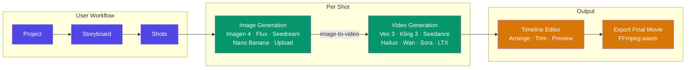
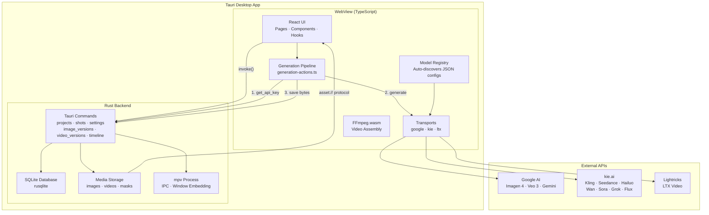
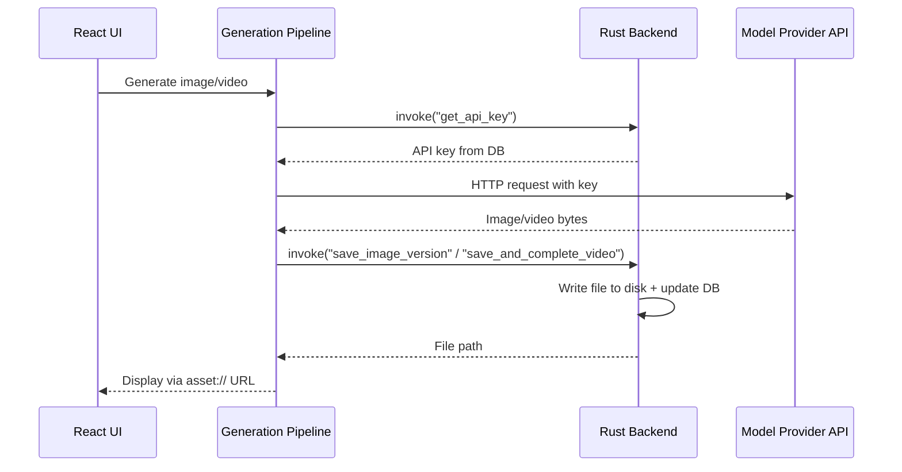
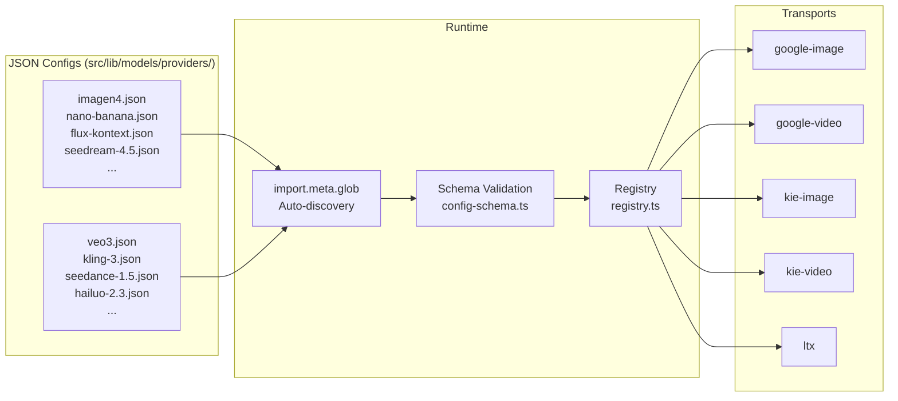
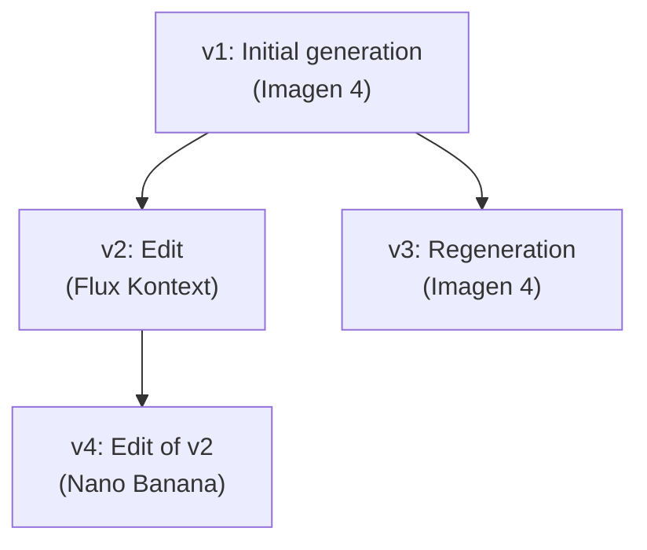

# Architecture

Showbiz is a hybrid [Tauri v2](https://v2.tauri.app/) desktop app. The Rust backend owns all persistent state — database, file system, and the mpv player process. The TypeScript frontend owns the UI and makes API calls to external model providers. They communicate over Tauri's IPC command system.

## High-Level Overview

## System Architecture

### Why Hybrid?

API calls live in TypeScript because:
- Model providers have complex, varied APIs (polling, streaming, multipart) that are easier to handle in TS
- The frontend already has the generation UI state and can show real-time progress
- API keys are fetched from Rust on demand and discarded after use — they never persist in JS memory

Persistence lives in Rust because:
- SQLite via rusqlite is faster and more reliable than any JS SQLite binding
- File I/O through Tauri commands gives proper sandboxed access to the app data directory
- mpv process management and IPC require native code

## Generation Flow

The generation pipeline keeps API keys secure while making calls from the frontend:

1. Frontend requests an API key from Rust (`get_api_key` command)
2. Frontend calls the model provider's API directly via the appropriate transport
3. Frontend sends the response bytes back to Rust for persistence
4. Rust writes the file to disk, updates the database, and returns the file path
5. Frontend displays the media via Tauri's `asset://` protocol with cache-busting timestamps

## Config-Driven Model System

Each model is a JSON config file in `src/lib/models/providers/`. At build time, Vite's `import.meta.glob` auto-discovers all configs. The registry validates them against a schema and wires each one to the appropriate transport. Adding a model that uses an existing API provider requires zero TypeScript — just a JSON file.

### Transports

Transports handle the API specifics for each provider. Most models reuse an existing transport — you only need a new one when integrating a completely new API provider.

| Transport | Provider | Models |
|-----------|----------|--------|
| `google-image` | Google AI | Imagen 4, Nano Banana, Nano Banana Pro |
| `google-video` | Google AI | Veo 3, Veo 3.1 Fast |
| `kie-image` | kie.ai | Flux Kontext, Seedream 4.5 |
| `kie-video` | kie.ai | Kling 3, Kling 2.6, Seedance 1.5, Hailuo 2.3, Wan 2.6, Sora 2, Grok |
| `ltx` | Lightricks | LTX Video |

### Adding a New Model

To add a model that uses an existing transport:

1. Create a JSON config in `src/lib/models/providers/video/` or `image/`
2. Set the `transport`, `apiKeyProvider`, model IDs, capabilities, and defaults
3. Run `yarn test` — schema validation catches mistakes automatically

See [`src/lib/models/providers/README.md`](../src/lib/models/providers/README.md) for the full config reference.

To add a completely new API provider, implement a transport in `src/lib/models/transports/`. See [`src/lib/models/transports/README.md`](../src/lib/models/transports/README.md).

## Version Trees

Both images and videos use a version tree system. Every generation or edit creates a new version linked to its parent. Users can switch between versions non-destructively at any time.

Image versions and video versions are tracked independently per shot, stored in the `image_versions` and `video_versions` tables with self-referential `parent_version_id` foreign keys.

## Video Assembly

Final movie export uses [FFmpeg.wasm](https://ffmpegwasm.netlify.app/) running entirely in the browser WebView. This requires Cross-Origin Isolation headers (COOP/COEP) for `SharedArrayBuffer`, configured in `vite.config.ts`.

The assembler supports:
- Concatenating all shot videos in order
- Per-shot trim in/out points from the timeline editor
- Re-encoding to ensure consistent format across clips

## mpv Embedding

Video playback uses mpv embedded into the application window via native window handles:

- **Linux**: Creates an X11 child window using `x11-dl`, passes the window ID to mpv via `--wid`
- **Windows**: Uses Win32 window handles
- **IPC**: Communicates with mpv over a JSON IPC socket for play/pause/seek/position commands

On Wayland desktops, the app forces XWayland (`GDK_BACKEND=x11`) because mpv embedding requires X11 window handles.

## Database

Six tables in SQLite with cascade deletes. Database stored at `{appDataDir}/data/showbiz.db`, media files under `{appDataDir}/media/`.

| Table | Purpose |
|-------|---------|
| `projects` | Top-level organizer |
| `storyboards` | Belongs to a project, stores selected image/video model |
| `shots` | Belongs to a storyboard, holds prompts, ordering, and status |
| `image_versions` | Version tree per shot (self-referential `parent_version_id`) |
| `timeline_edits` | Per-shot trim in/out points |
| `settings` | Key-value store for API keys and preferences |
